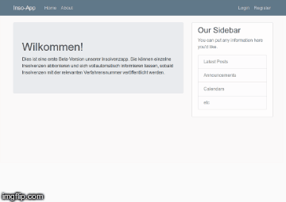

# inso
  *hold all the core components for the running website
  *creates and saves user generated insolvenzPosts
# logic
  *working scraper for insolvenzanzeigen.de
  *did finish a little early and scraped only 95% - needs a reliability check - catch exceptions
  *core of the programm - needs to be doubled up 
  *have both scrapers run frequently (implement with time - Monday morning?)
  *fill database and have main page recognize successful finds
# run
  *if executed, runs the whole program
  *On sever/localhost execute: python3 run.py on

### Coding
1. Regularly compare abbonierte Insolvenzverfahren with database (frequency?)
2. Scraper muss auch Verfahrensinhalt scrapen
3. Email an Kunde: Verfahrensupdate muss gestyled werden
4. Wie können wir die email über smtplib abschicken
5. python script muss stringent im Hintergrund laufen
6. export clrear text passwords to environment variables! 

### Social
1. Talk to Schoch about the Wettbewerb and get contact details to secretary
2. define additional functionality

### future research
1. Win would be great for traction and and publicity
2. prevent blocking by IP rotating (https://www.scrapehero.com/how-to-rotate-proxies-and-ip-addresses-using-python-3/)
3. i want this: https://github.com/cgoldsby/LoginCritter
2. Once the Verfahren is detected, automatically generate an Email with:
  *A notice
  *Next steps
  *Prefilled relevant documents
  *Drafts of relevant emails that need to be sent
